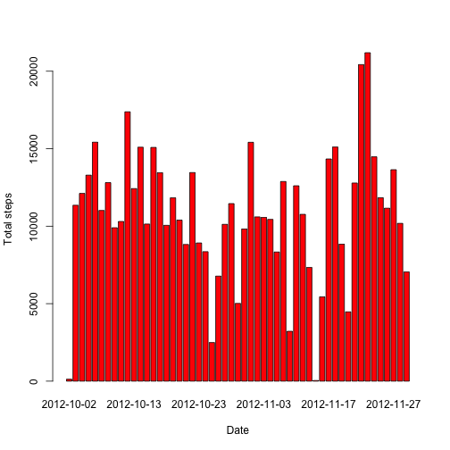
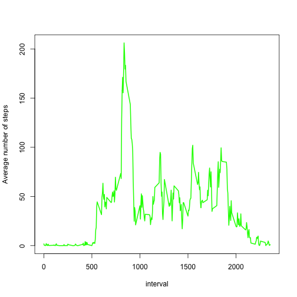
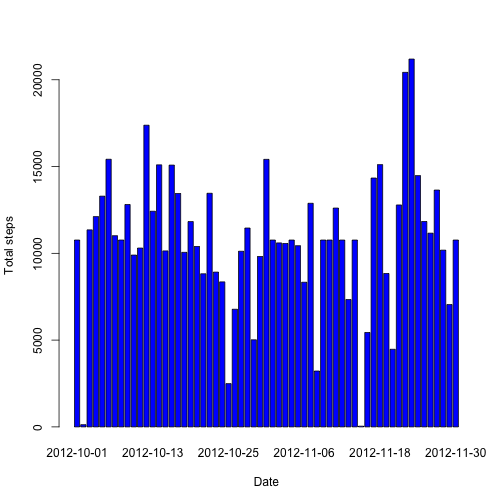
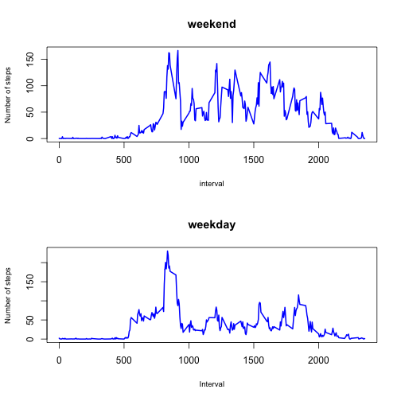

Coursera - Reproducible Research - Peer Assessment 1
========================================================

## Loading and preprocessing the data


```r
df <- read.csv("activity.csv", header = TRUE, stringsAsFactors = FALSE)
df$date <- as.Date(df$date)  # convert the date column to Date type
```


## What is mean total number of steps taken per day?

* Make a histogram of the total number of steps taken each day

```r
totalStepsDate <- aggregate(steps ~ date, data = df, FUN = sum)
barplot(totalStepsDate$steps, names.arg = totalStepsDate$date, xlab = "Date", 
    ylab = "Total steps", col = "red")
```

 

* Calculate and report the mean and median total number of steps taken per day

#### Mean

```r
mean(totalStepsDate$steps)
```

```
## [1] 10766
```


#### Median

```r
median(totalStepsDate$steps)
```

```
## [1] 10765
```


## What is the average daily activity pattern?

* Make a time series plot of the 5-minute interval (x-axis) and the average number of steps taken, averaged across all days (y-axis)


```r
meanStepsInterval <- aggregate(steps ~ interval, data = df, FUN = mean)
plot(meanStepsInterval, type = "l", ylab = "Average number of steps", col = "green", 
    lwd = 2)
```

 


* Which 5-minute interval, on average across all the days in the dataset, contains the maximum number of steps?


```r
meanStepsInterval$interval[which.max(meanStepsInterval$steps)]
```

```
## [1] 835
```


## Imputing missing values

* Calculate and report the total number of missing values in the dataset (i.e. the total number of rows with NAs). The presence of missing days may introduce bias into some calculations or summaries of the data.


```r
nrow(subset(df, is.na(df$steps)))
```

```
## [1] 2304
```


* Devise a strategy for filling in all of the missing values in the dataset. The strategy does not need to be sophisticated. For example, you could use the mean/median for that day, or the mean for that 5-minute interval, etc.

**I will replace the NA values with an average per time interval**
  
* Create a new dataset that is equal to the original dataset but with the missing data filled in.
   

```r
imputedMean <- df
for (i in which(is.na(df$steps))) {
    imputedMean[i, 1] <- meanStepsInterval[which(meanStepsInterval$interval == 
        imputedMean[i, 3]), 2]
}
```


* Make a histogram of the total number of steps taken each day
   

```r
imputedMeanStepsDate <- aggregate(steps ~ date, data = imputedMean, FUN = sum)
barplot(imputedMeanStepsDate$steps, names.arg = imputedMeanStepsDate$date, xlab = "Date", 
    ylab = "Total steps", col = "blue")
```

 


* Report the mean and median total number of steps taken per day

#### Mean

```r
mean(imputedMeanStepsDate$steps)
```

```
## [1] 10766
```


#### Median

```r
median(imputedMeanStepsDate$steps)
```

```
## [1] 10766
```


**Do these  values differ from the estimates from the first part of the assignment?**

There seems to be no significant difference from the estimates with missing data.

**What is the impact of imputing missing data on the estimates of the total daily number of steps?**
  
Imputing data does not have a noticeable impact on the estimates of the total 
daily number of steps

## Are there differences in activity patterns between weekdays and weekends?

* Create a new factor variable in the dataset with two levels – weekday and weekend indicating whether a given date is a weekday or weekend day.


```r
dataWithDays <- imputedMean
dataWithDays["daytype"] <- NA
for (i in 1:nrow(dataWithDays)) {
    if (weekdays(dataWithDays[i, 2]) %in% c("Saturday", "Sunday")) {
        dataWithDays[i, 4] <- "weekend"
    } else {
        dataWithDays[i, 4] <- "weekday"
    }
}
dataWithDays$daytype <- factor(dataWithDays$daytype)
```


* Make a panel plot containing a time series plot  of the 5-minute interval (x-axis) and the average number of steps taken, averaged across all weekday days or weekend days (y-axis). The plot should look something like the following, which was creating using simulated data:
   

```r
weekdays <- subset(dataWithDays, dataWithDays$daytype == "weekday")
weekends <- subset(dataWithDays, dataWithDays$daytype == "weekend")
meanStepsWeekdays <- aggregate(steps ~ interval, data = weekdays, FUN = mean)
meanStepsWeekends <- aggregate(steps ~ interval, data = weekends, FUN = mean)
par(mfrow = c(2, 1))
plot(meanStepsWeekends, type = "l", main = "weekend", xlab = "interval", ylab = "Number of steps", 
    col = "blue", cex.lab = 0.8, lwd = 2)
plot(meanStepsWeekdays, type = "l", main = "weekday", xlab = "Interval", ylab = "Number of steps", 
    col = "blue", cex.lab = 0.8, lwd = 2)
```

 

**Conclusion: the number of steps in the afternoon during weekends is greated than the number of steps in the afternoon during weekdays**
